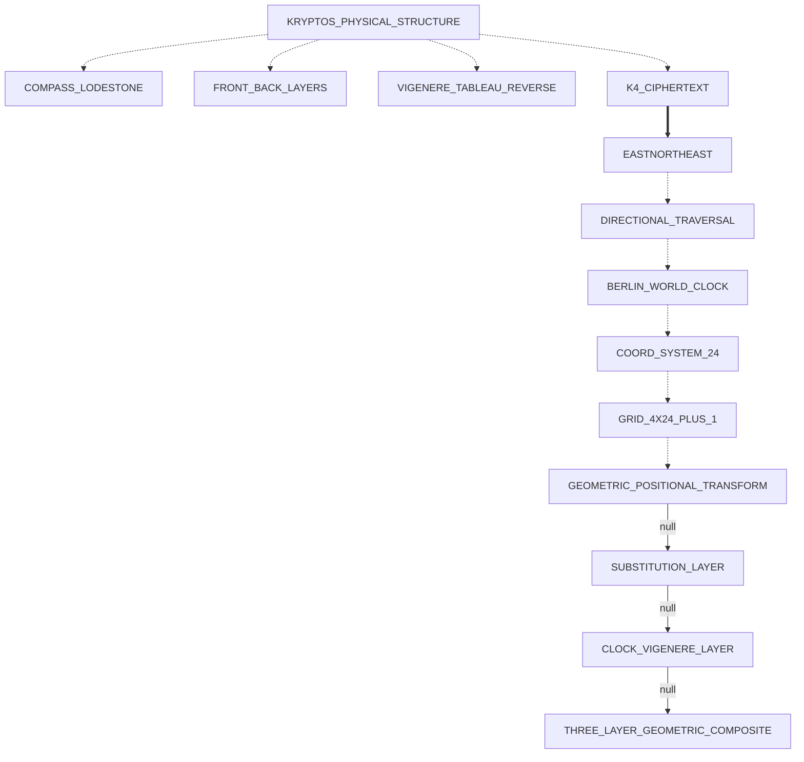

# K4 Active Research State

Breadcrumb: Home > Docs > Analysis > K4 Active Research


**Last Updated:** 2026-08-29
**Status:** Living document — update after each meaningful run or finding

This document tracks what is currently known, what has been tested and ruled out, and the active attack queue for K4 cryptanalysis.

---

## Confirmed Facts (High Confidence)

| Fact | Evidence | Source |
|------|----------|--------|
| K4 is 97 chars: `OBKRUOXOGHULBSOLIFBBWFLRVQQPRNGKSSOTWTQSJQSSEKZZWATJKLUDIAWINFBNYPVTTMZFPKWGDKZXTJCDIGKUHUAUEKCAR` | Sculpture transcription | Community |
| Plaintext at 0-indexed 22–25 = EAST | Sanborn confirmed | 2023 |
| Plaintext at 0-indexed 26–34 = NORTHEAST | Sanborn confirmed | 2020 |
| Plaintext contains BERLIN | Sanborn confirmed | 2010 |
| Plaintext contains CLOCK (follows BERLIN) | Sanborn confirmed | 2014 |
| BERLIN ciphertext = NYPVTT at 0-indexed 63–68 | Deduced from community position | Community |
| CLOCK ciphertext = MZFPK at 0-indexed 69–73 | Deduced from community position | Community |
| Sanborn used "five or six techniques" | Direct quote | Wired, 2005 |
| Deliberate misspellings likely in K4 (pattern from K1, K3) | IQLUSION, DESPARATLY | K1/K3 solved |
| K4 IC ≈ 0.062 (near-English, not random) | Computed | Internal |
| Local IC non-uniform across segments | Computed | Internal |

---

## Ruled Out (Confirmed Negative Results)

| Hypothesis | Status | Evidence |
|------------|--------|----------|
| Single-layer repeating Vigenère with any key | RULED OUT | HRDXDBAUZGSAV as repeating key does not produce English outside crib window |
| Direct Berlin Clock single-layer Vigenère | RULED OUT | All 720 clock states tested (`run_composite_sweep`). Shifts include 17, 20, 25 which no clock row can produce alone. |
| Transposition-first composite | RULED OUT | Non-uniform local IC is a signature of substitution-then-transposition order |
| Simple Caesar or monoalphabetic substitution | RULED OUT | IC ≈ 0.062 rules out single-alphabet substitution |
| K1/K2 keys (PALIMPSEST, ABSCISSA) as direct Vigenère keys for K4 | RULED OUT | Confirmed by community + pipeline results |
| Keyed alphabet (KRYPTOS/PALIMPSEST/ABSCISSA) realignment → structured keystream | RULED OUT | `check_keyed_alphabet_realignment` tested all three alphabets; keystream at EAST+NORTHEAST positions does not resolve to a recognizable pattern under any of them |
| Full composite sweep: 3 alphabets × 3 grid sizes × 720 clock states × ENE+columnar routes | NULL RESULT | `run_composite_sweep` completed; no simultaneous 4-crib match. Null artifact: `K4_COMPOSITE_SWEEP_NULL.json`. Best candidates had ≤1 keyword hit. |
| ENE diagonal route transposition (67.5°) with clock-Vigenère | NULL RESULT | `read_ene_diagonal` integrated into full sweep; all route variants tested. No breakthrough. |
| ADFGVX (Polybius + columnar transposition) | NULL RESULT | Implemented (`kryptos.k4.adfgvx`) and tested against K4; no crib match |
| Nihilist (Polybius + numeric key) | NULL RESULT | Implemented (`kryptos.k4.nihilist`) and tested against K4; no crib match |
| Pure (single-layer) Quagmire I–IV | NULL RESULT | `run_quagmire_sweep` — 6,240 combinations: Q1/Q2/Q3 × 4 alphabet keywords × 10 word keys × 2 indicator bases, Q4 ordered keyword pairs, plus Q3 × 1,440 Berlin Clock minute-state indicator keys on the KRYPTOS tableau. Zero positional crib or keyword hits. Artifact: `K4_QUAGMIRE_NULL.json`. Reinforces the substitution+transposition composite model — implementation verified by exactly reproducing K1/K2 (Quagmire III, KRYPTOS tableau). |
| Physical-grid (copper-screen tableau) keystreams | NULL RESULT | `run_physical_grid_attack` — walks the 26×26 KRYPTOS Vigenère tableau along 108 geometric routes (26 rows, 26 columns, 26 main/26 anti diagonals, 4 serpentine reads) × 2 indicator bases = 216 candidates via Quagmire III. Zero positional crib hits. Artifact: `K4_PHYSICAL_GRID_NULL.json`. Tests the "physical keystream read off the sculpture" theory. (Note: on the cyclic tableau the diagonals are degenerate — anti-diagonals are constant letters, main diagonals 13-letter cycles — so rows/columns/serpentine are the substantive routes.) |
| Combined 24-column geometric permutation + physical tableau (Physical/Geometric Pivot) | NULL RESULT | `run_geometry_combined_sweep` — 20 fill-orders/routes (16 `geometry24` orders incl. reversed + 4 ENE/NE route families) × 4 shape-preserving reflections × {0,+6,-6} Berlin/Langley rotation offsets × 3 remainder modes (trailing/leading/drop for the 97th char) × 108 `physical_grid` tableau routes × 2 indicator bases = **155,520 candidates**, ~7s. **Zero candidates matched even one positional crib** (`best_candidates` empty). Artifact: `K4_GEOMETRY_COMBINED_NULL.json`. This is the permutation front-end `physical_grid.py` lacked — see [Physical/Geometric Pivot](#physicalgeometric-pivot-2026-08-29) below. |
| Combined geometric permutation with geography-derived rotation offsets | NULL RESULT | Same sweep as above with `rotation_offsets` replaced by 6 geography-derived values (CIA→Berlin bearing mod 24, K2-coordinate-derived hours, magnetic declination) — **311,040 candidates**, ~14s. Zero positional crib hits (one incidental substring-only "EAST" keyword hit, not positionally correct). Artifact: `K4_GEOMETRY_COMBINED_GEO_NULL.json`. |
| Combined geometric permutation using the exact CIA→Berlin bearing as a route direction (item 12) | NULL RESULT | `order_names=GEO_BEARING_ORDER_NAMES` — the real ~44.4° great-circle bearing (not snapped to a named 16-point compass direction) and its 180°-reversed counterpart, traced via `ene_routes.trace_route`'s float-bearing support, × 4 reflections × {0,+6,-6} × 3 remainder modes × 108 tableau routes × 2 bases = **15,552 candidates**, <1s. Zero positional or keyword hits. Artifact: `K4_GEOMETRY_COMBINED_GEO_BEARING_NULL.json`. |
| Myszkowski transposition (P8) — repeated-letter keyword grouped-column transposition | NULL RESULT | `run_myszkowski_attack` (`kryptos.k4.myszkowski`) — `ABSCISSA` and `PALIMPSEST` (the two Kryptos keys that actually have repeated letters; KRYPTOS doesn't) × decrypt/encrypt direction = **4 candidates**. Zero positional or keyword hits. Artifact: `K4_MYSZKOWSKI_NULL.json`. |
| Trifid cipher (P9) — 27-cell (3×3×3) cube fractionation | NULL RESULT | `run_trifid_attack` (`kryptos.k4.trifid`) — 6 keyword candidates (KRYPTOS, PALIMPSEST, ABSCISSA, and 3 pairwise concatenations) × 13 period lengths (3–97) = **78 candidates**. Zero positional or keyword hits. Artifact: `K4_TRIFID_NULL.json`. |
| Simulated-annealing substitution-key search behind a Phase-1 geometric permutation front-end (item 15, optional) | NULL RESULT | `run_geometry_substitution_sa_sweep` (`kryptos.k4.geometry_substitution_search`) — 8 base `geometry24` fill orders (identity reflection, zero rotation, trailing remainder) × 3 SA restarts (3,000 iterations each, temperature/cooling schedule) = **24 candidates**, ~14s. Zero positional crib hits (one incidental substring-only "BERLIN" keyword hit, not positionally correct). Artifact: `K4_GEOMETRY_SUBSTITUTION_SA_NULL.json`. Fills a genuine gap in the existing heuristic-search infrastructure (`hill_genetic.py` is Hill-3×3-specific, `transposition_analysis.py`'s SA is columnar-permutation-specific): a proper SA search over the general substitution key space, paired with the Phase-1 geometric permutation inversion instead of only the handful of named keyed alphabets every other composite sweep tries. |

---

## Current Structural Understanding

**Cipher architecture (most likely):**
```
plaintext
    ↓
[Layer A: substitution — likely polyalphabetic or matrix-based]
    ↓
pre-transposition text
    ↓
[Layer B: transposition — geometric/columnar/route]
    ↓
K4 ciphertext (97 chars)
```

**Decryption direction (attack):**
```
K4 ciphertext
    ↓
[Invert Layer B: transposition reversal]
    ↓
substituted-but-not-transposed text
    ↓
[Invert Layer A: substitution reversal with key]
    ↓
plaintext
```

**Key insight:** The 13 characters at K4 positions 22–34 (LRVQQPRNGKSSO) that produce EASTNORTHEAST under some key were NOT contiguous in the pre-transposition text. The transposition pulled them from scattered positions. Reversing the transposition first is the prerequisite for clean substitution key recovery.

### Derived Keystreams (Vigenère-equivalent per-position shifts)

Assuming pure Vigenère at the substitution layer (before transposition):

```
EAST (pos 22–25):      keystream = HRDX  (shifts: 7, 17, 3, 23)
NORTHEAST (pos 26–34): keystream = DBAUZGSAV  (shifts: 3, 1, 0, 20, 25, 6, 18, 0, 21)
BERLIN (pos 63–68):    keystream = MUYKLG  (shifts: 12, 20, 24, 10, 11, 6)
CLOCK (pos 69–73):     keystream = KORNA  (shifts: 10, 14, 17, 13, 0)
```

Under the composite model, these are NOT the actual substitution key letters at those positions — they are the effective shifts after the transposition has already rearranged things. The true key letters live at the transposition source positions, not the ciphertext positions.

---

## Completed Attack Queue — All Prior Vectors (as of 2026-08-12)

Rows 1–3 and 6–14 are cipher-attack sweeps that returned null results. Rows 4–5 are infrastructure/confirmed facts, not attack sweeps — they are included for completeness but should not be counted in null-result tallies.

| # | Attack / Capability | Module | Result |
|---|---------------------|--------|--------|
| 1 | Inverse Transposition + Keystream Collapse | `inverse_transposition_sweep.full_sweep` | **Null** |
| 2 | Keyed Alphabet Realignment (KRYPTOS/PALIMPSEST/ABSCISSA) | `check_keyed_alphabet_realignment` | **Null** |
| 3 | Full Composite Sweep (3 alphabets × 3 grids × 720 clock states × ENE+columnar) | `run_composite_sweep` | **Null** |
| 4 | InstructionalScorer (geography/imperative vocab boost + Levenshtein) | `scoring_instructional` | Integrated (infrastructure) |
| 5 | BERLIN+CLOCK Positional Refinement | `validate_k4_cribs` / `keystream_summary` | Confirmed (architecture) |
| 6 | Clock → Hill 2×2 Invertibility Pre-filter | `run_clock_hill_attack` | **Null** |
| 7 | 4-char Clock Key → Vigenère with NORTHEAST Anchor | `run_clock_vigenere_attack` | **Null** |
| 8 | Non-standard Berlin Clock Sub-row Encodings | `run_clock_subrow_attack` | **Null** |
| 9 | Berlin Clock Lamp Counts as Transposition Column Widths | `run_clock_transposition_attack` | **Null** |
| 10 | Beaufort Cipher Sweep (10 key candidates × 2 alphabets) | `run_beaufort_sweep` | **Null** |
| 11 | Quagmire I–IV (6,240 combos including Q3 Berlin Clock minute-state keys) | `run_quagmire_sweep` | **Null** |
| 12 | Physical-Grid Tableau Walk (108 geometric routes × 2 indicator bases) | `run_physical_grid_attack` | **Null** |
| 13 | ADFGVX (Polybius + columnar) | `kryptos.k4.adfgvx` | **Null** |
| 14 | Nihilist (Polybius + numeric key) | `kryptos.k4.nihilist` | **Null** |

---

## Active Attack Queue — FRONTIER (as of 2026-08-12)

Every clean 2-layer composite and every direct clock-keying variant has now returned null. The frontier shifts to: (a) 3-layer composites, (b) pre-cipher masking/null removal, and (c) clock key derivation approaches that treat K2 coordinates or timezone offsets as secondary inputs.

See [`docs/analysis/K4_ATTACK_LANDSCAPE.md`](K4_ATTACK_LANDSCAPE.md) for the full 3D fingerprint (past / present / frontier).

### ✅ Priority 1 (COMPLETE — NULL RESULT): 3-Layer Composite — Keyed-Alphabet → Clock-Vigenère → Columnar Transposition

*(Entry stale since 2026-08-12 — this doc listed it OPEN after it had already been implemented; corrected 2026-08-29 as part of the Physical/Geometric Pivot's doc-hygiene pass.)*

Implemented in `kryptos.k4.three_layer_composite.run_three_layer_composite` — chains (1) keyed-alphabet mono-substitution, (2) clock-derived Vigenère (CIA-dedication-timestamp states prioritized, then a full hourly sweep), and (3) brute-force columnar transposition at grid widths `[7, 8, 10]` (`K4_GRID_GEOMETRIES`), gated on all 4 confirmed cribs. **Null result.** Artifact: `K4_3LAYER_NULL.json`. Also wired into the API as `p1_three_layer` and, with a relaxed 2-crib gate, as `p5_two_crib_filter`. See the Physical/Geometric Pivot's `run_three_layer_composite_geometric` for the follow-on that swaps the brute-force columnar layer for the Pivot's 24-column named geometric permutations — a distinct search space (`K4_GRID_GEOMETRIES` never includes width 24), not a duplicate of this entry.

### 🔴 Priority 2 (OPEN): Shadow/Null Masking as Layer 0

The World Clock source material describes "the secret is the shadow of the word" — a physical position-masking theory where some K4 characters are null inserts (clock-shadow positions), and the real 64–88 character message is the remainder. If a masking layer preceded the cipher layers, every 2-layer attack on the full 97-char sequence is attacking padded input.

Specific variants to test:
- Remove every N-th character (N=2,3,4) → decrypt the residue
- Remove characters at positions corresponding to the clock-shadow angle at a specific timestamp (clock hand position → arc fraction × 97)
- Remove characters whose index is a clock-lamp-off position

**Estimated search space:** ~12 masking variants × full composite sweep. Each variant produces a shorter text; crib positions must be recalculated.

### ✅ Priority 3 (COMPLETE — NULL RESULT): K2 Coordinate Digits as Clock State Selectors

*(Entry stale since 2026-08-12; corrected 2026-08-29.)*

`kryptos.k4.k2_clock_states.get_k2_clock_states` isolates exactly these timestamps (`K2_CLOCK_TIMES`: 14:57, 06:05, 17:08, 08:44, 13:57), wired into the API as `p3_k2_coord_clock` — each state's clock-Vigenère shifts tested against all `KNOWN_KEYED_ALPHABETS`, then brute-force columnar transposition at widths `[7, 8, 10]`. **Null result** (zero keyword hits across all states tested).

### ✅ Priority 4 (COMPLETE — NULL RESULT): 6-Hour Berlin→CIA Timezone Offset as Cipher Modifier

*(Entry stale since 2026-08-12; corrected 2026-08-29.)*

`kryptos.k4.k2_clock_states.get_tz_offset_states` applies the ±6-hour offset to the CIA-dedication clock states, wired into the API as `p4_timezone_offset` — same clock-Vigenère + columnar-transposition pipeline as Priority 3. **Null result.** The Physical/Geometric Pivot's `clock_rotation.py` (`BERLIN_LANGLEY_OFFSET_HOURS`, `PRIORITY_OFFSETS`) separately tests this same 6-hour offset as a *positional* permutation of the 24-column grid rather than a Vigenère-key-index shift — also null (see `docs/analysis/K4_ACTIVE_RESEARCH.md`'s Physical/Geometric Pivot section).

### 🟡 Priority 5 (OPEN): BERLIN+CLOCK Partial Match Isolation

The full sweep validated all 4 cribs simultaneously. Relaxing to 2-crib validation (BERLIN+CLOCK only at positions 63–73) with a wider transposition search may surface partial-solution candidates that the strict 4-crib gate rejected. This is a softer filter that widens the search net.

### 🟡 Priority 6 (OPEN): Running Key from K3 Plaintext

K3's plaintext is approximately 336 characters. Using the first 97 characters of K3's decrypted plaintext as a running Vigenère key for K4 has never been attempted. Sanborn called K4 the "last layer" — if the sections are chained, earlier plaintext may be the key material for the next section.

### ✅ Priority 7 (COMPLETE — NULL RESULT): Gronsfeld Cipher (Numeric Key from K2 Coordinates)

*(Entry stale since 2026-08-12 — said "not yet implemented"; corrected 2026-08-29.)*

Implemented in `kryptos.k4.gronsfeld.run_gronsfeld_sweep` — 5 K2-coordinate-derived digit keys (`K2_COORDINATE_KEYS`: `385765`, `770844`, `385706577`, `3857`, `3857065770844`) applied as Gronsfeld shifts. **Null result.** Wired into the API as `p7_gronsfeld`.

### 🔵 Deferred (LOWER PRIORITY): P8–P10

These three directions are structurally distinct but lower-probability given the K1–K3 pattern.

- ✅ **P8 — Myszkowski Transposition (COMPLETE — NULL RESULT, 2026-08-29):** Repeated-letter keywords (ABSCISSA, PALIMPSEST) with Myszkowski column-grouping (tied-rank columns read row-by-row together rather than one at a time). Note: KRYPTOS itself has no repeated letters and does not demonstrate Myszkowski behavior. Implemented as a self-contained `kryptos.k4.myszkowski` module (the grouped-row read pattern isn't reducible to `transposition.py`'s whole-column-read `apply_columnar_permutation`, so "reuse the columnar solver" from the original scoping note didn't hold up once the primitive was actually written). See Ruled Out table above.
- ✅ **P9 — Trifid Cipher (COMPLETE — NULL RESULT, 2026-08-29):** 27-cell (3×3×3) cube fractionation extending Bifid to triples. Implemented in `kryptos.k4.trifid` — keyword-mixed cube (reuses `quagmire.keyword_alphabet`) + a filler 27th symbol, block-wise encrypt/decrypt, swept across 6 keyword candidates × 13 period lengths. See Ruled Out table above.
- **P10 — Straddle Checkerboard:** Implemented in an earlier session (`kryptos.k4.straddling_checkerboard`) — out of scope for this pass, not touched here.

---

## Existing Infrastructure Status

| Component | Status | Notes |
|-----------|--------|-------|
| Hill constraint stage | ✅ Working | Tests passing |
| Transposition adaptive stage | ✅ Working | Tests passing |
| Berlin clock (single-layer) | ✅ Complete | All 720 states tested; ruled out as standalone |
| Composite pipeline | ✅ Working | `run_composite_pipeline` + `CompositeChainExecutor` |
| Quadgram scoring | ✅ Working | High-quality TSV loaded from `data/ngrams/` |
| Positional crib bonus | ✅ Working | `make_transposition_multi_crib_stage` |
| InstructionalScorer | ✅ Complete | `kryptos.k4.scoring_instructional` — vocabulary, Levenshtein, entropy gate |
| ENE diagonal transposition | ✅ Complete | `read_ene_diagonal` in `transposition_routes.py`; integrated into `full_sweep` |
| Inverse transposition sweep | ✅ Complete | `kryptos.k4.inverse_transposition_sweep` — all 3 grid geometries, ENE+columnar routes |
| Keyed alphabet realignment test | ✅ Complete | `check_keyed_alphabet_realignment` — KRYPTOS/PALIMPSEST/ABSCISSA all tested; null result |
| Eureka capture protocol | ✅ Complete | `kryptos.k4.eureka` — 4-crib match, snapshot, halt wired into `CompositeChainExecutor` |
| Period-13 keystream validator | ✅ Complete | `kryptos.k4.keystream_validator` — `validate_k4_cribs`, `keystream_summary` |
| Full composite parameter sweep | ✅ Complete | `run_composite_sweep` — alphabets × grids × clock states × routes; null result |
| S→T→S 3-layer chain | ✅ Complete | `CompositeChainExecutor.substitution_then_transposition_then_substitution()` |
| ADFGVX | ✅ Complete | `kryptos.k4.adfgvx`; null result against K4 |
| Nihilist | ✅ Complete | `kryptos.k4.nihilist`; null result against K4 |
| Beaufort | ✅ Complete | `kryptos.k4.beaufort` (primitives); systematic K4 sweep now in `kryptos.k4.beaufort_sweep` |
| Clock → Hill 2×2 invertibility pre-filter | ✅ Complete | `kryptos.k4.clock_hill_attack.run_clock_hill_attack` — filters clock states by Hill invertibility, applies Hill 2×2, validates 4 cribs. **Null result.** |
| 4-char clock key → Vigenère attack | ✅ Complete | `kryptos.k4.clock_hill_attack.run_clock_vigenere_attack` — 4 encoding schemes × 720 states; NORTHEAST positional gating. **Null result.** |
| Non-standard Berlin Clock sub-row encodings | ✅ Complete | `kryptos.k4.clock_subrow_attack.run_clock_subrow_attack` — 4 sub-row schemes as short Vigenère keys. **Null result.** |
| Berlin Clock lamp counts as transposition column widths | ✅ Complete | `kryptos.k4.clock_subrow_attack.run_clock_transposition_attack` — lamp values as columnar transposition widths. **Null result.** |
| Beaufort sweep against K4 | ✅ Complete | `kryptos.k4.beaufort_sweep.run_beaufort_sweep` — 10 key candidates × 2 alphabets. **Null result.** |
| Quagmire I–IV primitives | ✅ Complete | `kryptos.k4.quagmire` — canonical encrypt/decrypt for all four variants; Q3 with KRYPTOS tableau exactly reproduces K1/K2 (ground-truth tested). |
| Quagmire sweep against K4 | ✅ Complete | `kryptos.k4.quagmire_sweep.run_quagmire_sweep` — Q1–Q4 word keys + Q3 Berlin Clock minute-state indicator keys; positional crib gating; null result. |
| Physical-grid tableau-walk keystreams | ✅ Complete | `kryptos.k4.physical_grid.run_physical_grid_attack` — builds the KRYPTOS Vigenère tableau, walks 108 geometric routes into Quagmire III; positional crib gating; null result. |
| SA columnar transposition (seedable) | ✅ Verified | `solve_columnar_permutation_simulated_annealing(..., seed_perm=...)` — gains an optional starting permutation so the search can be seeded from a known pattern (e.g. K3's width/rotation). Verified end-to-end (`tests/e2e/test_sa_transposition_crib_lock.py`): recovers a planted columnar plaintext on realistic-length text; seeding at the optimum never scores worse than the seed. |
| Early-crib locking (search pruning) | ✅ Verified | `search_with_multiple_cribs_positions` rejects permutations that don't place the cribs at their known positions *before* scoring. Verified to prune >90% of the columnar permutation space at depth 1 (5040→2 for one crib, →1 for two) while always retaining the true permutation, and the top crib-consistent candidate is the real plaintext. Sidesteps the n-gram scoring misranking that affects short fragments. |
| 24-column grid + fill-order engine | ✅ Complete | `kryptos.k4.geometry24` — 4×24(+1) grid, 8 base fill orders (row/col-major, boustrophedon, alternating-column, spiral, outside-in, center-out, circular-wrapped) + reversed variants (16 total), 3 remainder-handling modes for the 97th character (trailing/leading/drop). |
| Physical front/back reflection library | ✅ Complete | `kryptos.k4.reflection` — 8 coordinate transforms (identity/flip_h/flip_v/rotate_180 + transpose family); `back_mirror_col`/`back_mirror_row`/`back_mirror_both` are literal aliases matching the brief's `back(row,23-col)` / `back(3-row,col)` / `back(3-row,23-col)` formulas — which turn out to be exactly the flip/rotate family, not new math. |
| 24-position clock permutation + Berlin/Langley rotation | ✅ Complete | `kryptos.k4.clock_rotation` — column-index permutation (not a Caesar shift); `geography_priority_offsets()` reuses (does not re-derive) `bearing_attack.CIA_BERLIN_BEARING_INT` and `k2_clock_states` values as additional named offset candidates; `geography_derived_bearings()` exposes the exact (unrounded) CIA→Berlin bearing as a route direction for `ene_routes` (item 12). |
| ENE/16-point compass route generator | ✅ Complete | `kryptos.k4.ene_routes` — discrete rational (`fractions.Fraction`) column-per-row slopes for all 16 compass points; the 24-ribbon family per direction is a proven bijection over the 4×24 grid. |
| Canonical hypothesis graph | ✅ Complete | `kryptos.k4.hypothesis_graph` — file-persisted graph mirroring the brief's flow diagram, status per edge (untested/null/partial_null/confirmed/eureka), Mermaid + Markdown rendering. Snapshot: `K4_HYPOTHESIS_GRAPH.json`. |
| Strict validation pipeline + adversarial benchmarks | ✅ Complete | `kryptos.k4.validation` — Prediction Standard levels (crib match, complexity/overfitting guard, independent reproduction check) gating what may be promoted to a breakthrough snapshot; `EXTERNAL_CANDIDATES` registry independently checks outside claims (see Physical/Geometric Pivot section below). |
| Combined geometric-permutation + tableau attack | ✅ Complete | `kryptos.k4.geometry_combined_sweep` — composes fill-order/route → reflection → rotation into a 97-length ciphertext permutation, then reuses `physical_grid`'s tableau keystreams via Quagmire III. **Null result** — see Ruled Out table above. |
| 3-layer geometric composite (Phase 2, item 13) | ✅ Complete | `kryptos.k4.three_layer_composite.run_three_layer_composite_geometric` — mono-subst(keyed) → clock-Vigenère → Phase 1's named 24-column geometric permutation (swaps out `run_three_layer_composite`'s brute-force arbitrary columnar transposition). **Null result** — see Physical/Geometric Pivot §Phase 2 below. |
| Myszkowski transposition (P8, item 14) | ✅ Complete | `kryptos.k4.myszkowski` — repeated-letter-keyword grouped-column transposition primitives (`myszkowski_encrypt`/`myszkowski_decrypt`) + `run_myszkowski_attack` sweep over ABSCISSA/PALIMPSEST × decrypt/encrypt. **Null result.** |
| Trifid cipher (P9, item 14) | ✅ Complete | `kryptos.k4.trifid` — 27-cell (3×3×3) cube fractionation primitives (`trifid_encrypt`/`trifid_decrypt`, keyword-mixed cube via `quagmire.keyword_alphabet` + filler symbol) + `run_trifid_attack` sweep over 6 keyword candidates × 13 period lengths. **Null result.** |
| SA substitution-key search + geometric front-end (P15, item 15, optional) | ✅ Complete | `kryptos.k4.geometry_substitution_search.run_geometry_substitution_sa_sweep` — proper simulated annealing (temperature/cooling, following the same pattern as `transposition_analysis`'s columnar SA) over the 26-letter substitution key space, applied to text produced by inverting a Phase-1 `geometry24` fill order; fills the gap left by `hill_genetic.py` (Hill-3×3-only) and `transposition_analysis.py`'s SA (columnar-permutation-only). **Null result.** |

---

## Position Reference Quick Table

All 0-indexed within K4 string starting with `OBKRUOXO...`:

```
Position  22: L   ← start of EAST crib window
Position  23: R
Position  24: V
Position  25: Q   ← end of EAST
Position  26: Q   ← start of NORTHEAST crib window
Position  27: P
Position  28: R
Position  29: N
Position  30: G
Position  31: K
Position  32: S
Position  33: S
Position  34: O   ← end of NORTHEAST
...
Position  63: N   ← start of BERLIN (1-indexed 64)
Position  64: Y
Position  65: P
Position  66: V
Position  67: T
Position  68: T   ← end of BERLIN
Position  69: M   ← start of CLOCK
Position  70: Z
Position  71: F
Position  72: P
Position  73: K   ← end of CLOCK
```

---

## Known Documentation Issues (Not Yet Fixed in Code)

| File | Issue | Correct Value |
|------|-------|---------------|
| `CONTRIBUTING.md` | `'NORTHEAST': [25]` in positional_cribs | Should be `[26]` |
| `CONTRIBUTING.md` | `'BERLIN': [64]` in positional_cribs | Should be `[63]` |
| `docs/analysis/K4-CLOCKS.html` | States NYPVTTMZF at "positions 26–34" | NYPVTTMZF is at 0-indexed 63–71; cipher at 26–34 is QPRNGKSSO |

---

## Physical/Geometric Pivot (2026-08-29)

A research brief ("K4 Next Steps — Physical/Geometric Pivot") redirected the attack surface from "what cipher/key produces K4?" toward "what physical coordinate system, orientation, and traversal does the sculpture itself specify?" — see the seven new modules and combined sweep in the Existing Infrastructure Status table above. Full detail (design rationale, module-by-module notes) lives in the implementation plan; this section records what actually ran and what it found.

**Item 1 (canonicalize crib positions) was already satisfied** before this pivot started: `keystream_validator.K4_CRIBS` is the single canonical source and matches this document's own Position Reference Quick Table exactly. The `CONTRIBUTING.md` file the "Known Documentation Issues" section below flags no longer exists in this repo, so that issue is moot.

**Item 12** ("combine geographic vectors with grid orientation") is covered: `clock_rotation.geography_derived_bearings()` exposes the exact CIA→Berlin great-circle bearing (~44.4°, not snapped to a named compass point) and its 180°-reversed counterpart as route directions, reusing `ene_routes.trace_route`'s existing float-bearing support (no new arithmetic — this is direct reuse of the ENE-route machinery built for item 6). **Item 13** ("explore 3+ layer classical composites") is covered by `run_three_layer_composite_geometric` (Phase 2, below). **Items 10–11** (historical CIA physical-object inventory; physical Berlin World Clock investigation) remain explicitly deferred — they are historical/archival research tasks rather than coding tasks, and need user-supplied sources (as with the Field Guide/kryptosbot URLs) before attempting. **Items 14–16** (remaining obscure cipher families, large unconstrained heuristic searches) are the brief's own explicit lowest-priority tier ("ONLY AFTER THAT") and a substantially different, separate body of work — out of scope for this pivot (items 14 and 15 were picked up in a Phase 3 follow-on; see below).

### Canonical hypothesis graph

Rendered from `K4_HYPOTHESIS_GRAPH.json` after the runs below (`==>` confirmed, `-- null -->` null, `-.->` untested):



The `GEOMETRIC_POSITIONAL_TRANSFORM -> SUBSTITUTION_LAYER` edge is what the combined sweep directly tests; the two Phase 2 edges (`SUBSTITUTION_LAYER -> CLOCK_VIGENERE_LAYER -> THREE_LAYER_GEOMETRIC_COMPOSITE`) are `run_three_layer_composite_geometric`'s (see below). The remaining upstream edges (compass/lodestone, front/back layers, tableau-reverse, the clock-as-coordinate-system interpretation) remain untested and are natural next steps — most concretely, wiring `reflection.py`'s shape-changing (transpose) family and a genuine front/back tableau mapping into the sweep, which the current default scope deliberately excludes to bound combinatorics (see `geometry_combined_sweep.py`'s docstring).

### External candidate adversarial benchmarks

Two external sources were checked independently — neither is accepted on the source's own say-so:

- **solvekryptos.com/fieldguide** claims a complete K4 plaintext (`"THE COMPASS ROSE IS HERE X EAST NORTHEAST THIS IS YOUR POSITION X COMMISSION BERLIN CLOCK WHICH IS NORTHEAST OF HERE X"`) via an undisclosed Quagmire-III-variant (f-table/g-table values not published, so the mechanism itself isn't independently reproducible here). Checked against the confirmed crib positions with `X` counted as a literal character — the only way the claim reaches K4's exact 97-character length: **`BERLIN` and `CLOCK` land exactly at the confirmed positions (63, 69), but `EAST` and `NORTHEAST` are off by exactly one position** (found at 21/25, not 22/26). Verdict: **fails strict positional validation at 2 of 4 confirmed anchors** — reproducible via `kryptos.k4.validation.benchmark_external_candidate("solvekryptos_field_guide")`. This is a partial, specific disagreement (not a clean match, not a clean miss) and is recorded as such rather than as either an endorsement or a dismissal.
- **kryptosbot.com/findings** proposes no candidate plaintext (13,302 audited candidates, zero survive verification per the source) — used as a corroborating negative-result cross-reference (its eliminated cipher families overlap heavily with the Ruled Out table above) and as the source of two structural diagnostics now available for future candidates: `check_w_delimiter_pattern` and `check_stehle_anomaly`. Run against real K4: five `W` characters at 0-indexed positions `[20, 36, 48, 58, 74]` (matches the source's "five W characters" description); the letter-to-letter shift sequence in the ciphertext window at positions 55–63 (`DIAWINFB`) is `[5, 18, 22, 12, 5, 18, 22]` — **not constant, but period-4** (indices 0–2 repeat exactly at indices 4–6). Neither diagnostic asserts a theory is true; both are reusable, honest observations pending a precise definition of kryptosbot's own methodology (not available from the page fetched).

### Combined sweep results

| Run | Scope | Candidates | Time | Result |
|-----|-------|-----------|------|--------|
| Default (Berlin/Langley ±6 priority) | 20 orders × 4 reflections × {0,+6,-6} × 3 remainder modes × 108 tableau routes × 2 bases | 155,520 | ~7s | Null — zero candidates matched even one positional crib |
| Geography-derived offsets | Same, `rotation_offsets` = 6 values from `clock_rotation.geography_priority_offsets()` (CIA→Berlin bearing, K2-coordinate hours, magnetic declination) | 311,040 | ~14s | Null — one incidental substring-only keyword hit, no positional crib hits |
| Geography-derived bearing as route direction (item 12) | `order_names=GEO_BEARING_ORDER_NAMES` (the exact CIA→Berlin bearing + its reverse) × 4 reflections × {0,+6,-6} × 3 remainder modes × 108 tableau routes × 2 bases | 15,552 | <1s | Null — zero positional or keyword hits |

Each run's full parameters and top candidates are preserved in `K4_GEOMETRY_COMBINED_NULL.json`, `K4_GEOMETRY_COMBINED_GEO_NULL.json`, and `K4_GEOMETRY_COMBINED_GEO_BEARING_NULL.json` respectively, per the regressionless-development protocol (every null result gets a permanent artifact).

### Phase 2 (2026-08-29): 3-layer geometric composite (item 13)

Auditing the brief's items 9–16 against what's actually implemented (not what the brief assumed) found that item 9 is already covered by `bearing_attack.py` and item 12 was completed above; items 10–11 are archival/historical research tasks rather than coding tasks and are deferred pending user-supplied sources (as with the Field Guide/kryptosbot URLs); items 14–16 are the brief's own explicit lowest-priority tier. That leaves **item 13** ("explore 3+ layer classical composites") as the next well-scoped, code-only increment.

`kryptos.k4.three_layer_composite.run_three_layer_composite` (Priority 1, below) already chains mono-substitution → clock-Vigenère → **brute-force arbitrary columnar transposition** at grid widths `[7, 8, 10]` — never the 24-column grid, and never the Phase 1 pivot's *named* geometric fill-orders/reflections/rotations. `run_three_layer_composite_geometric` (new) swaps that transposition layer for Phase 1's `geometry24`/`geometry_combined_sweep` machinery, reusing this module's own `_mono_subst_decrypt`/`_vigenere_decrypt_std`/`_build_clock_sequence` unchanged — a genuinely distinct search space, not a duplicate.

| Run | Scope | Candidates | Time | Result |
|-----|-------|-----------|------|--------|
| Default (priority CIA-timestamp clock states) | 2 clock states × 4 keyed alphabets × 720 geometric-permutation combos | 5,760 | ~1s | Null |
| Full clock sweep | 24 hourly clock states × 4 alphabets × 720 combos | 69,120 | ~12s | Null |

Both null. Artifacts: `K4_3LAYER_GEOMETRIC_NULL.json`, `K4_3LAYER_GEOMETRIC_FULL_NULL.json`. Recorded on two new hypothesis-graph edges (`SUBSTITUTION_LAYER -> CLOCK_VIGENERE_LAYER -> THREE_LAYER_GEOMETRIC_COMPOSITE`, extending the graph additively — see the updated diagram above).

**Grand total across all five real-K4 runs in this pivot (Phase 1 + Phase 2): 556,992 candidates, zero breakthroughs.**

### Phase 2 addendum (2026-08-29): items 10–11 research findings

Items 10–11 (historical physical-object search; physical Berlin World Clock investigation) are archival research tasks, not coding tasks — no attack module came out of this pass. What follows is what was actually verified via web sources, with two corrections to assumptions this doc made earlier.

**Item 11 — Berlin World Clock (Weltzeituhr, Alexanderplatz):**
- A true 24-sided cylinder (regular icositetragon cross-section), ~10m tall, designed by Erich John, unveiled 1969. [Wikipedia (EN)](https://en.wikipedia.org/wiki/World_Clock_(Alexanderplatz)), [Wikipedia (DE)](https://de.wikipedia.org/wiki/Weltzeituhr_(Alexanderplatz))
- Displays **146 city/location names plus one additional, distinct entry specifically for the International Date Line** — the date-line boundary is a dedicated marker, not just an implicit gap between adjacent sectors.
- The base has a **stone mosaic in the shape of a wind rose** (compass rose) marking cardinal directions — a genuine, sourced link between the clock and compass/orientation symbolism, independent of anything at the Kryptos site itself.
- No source gives the exact city-to-side ordering, nor the monument's own compass orientation as installed. Both would require photographic/in-person documentation to pin down — not fabricated here.
- No CIA, Langley, or American reference point is mentioned in connection with the clock in any source checked.

**Item 10 — physical objects at the Kryptos site:**
- Confirmed via CIA's own legacy materials and community sources: a lodestone co-located with an engraved compass rose stone (the engraved needle points at the lodestone), separate Morse-code and classical-cipher granite slabs at the New Headquarters Building entrance (a different location from the main copper-screen sculpture), and the petrified-wood base under the copper screen.
- **No Berlin Wall fragment found in any source** — that specific brief hypothesis appears unfounded; treating it as ruled out pending contrary evidence.
- Community reporting (general web synthesis) describes a carved bearing line on the compass rose stone along the intercardinal axis, consistent with the ENE direction already implied by the "EASTNORTHEAST" plaintext — corroboration for, not new information beyond, the `ENE`/`NE`/`ENE_REVERSED`/`NE_REVERSED` priority directions already implemented in `ene_routes.py` and already tested null in Phase 1.

**Two corrections to prior assumptions in this document:**
1. The lodestone's exact compass-deflection bearing is **explicitly unmeasured** per the community's own authoritative tracking page — [elonka.com's Kryptos measurement wish list](https://www.elonka.com/kryptos/wishlist.html) lists "which way *exactly* is the needle on the compass rose pointing?" as an open, unanswered question as of this research. Earlier informal mentions of "west-southwest" in general web summaries should be read as unverified community characterization, not a measured figure — noted here so it isn't repeated as settled fact.
2. K2's coordinate plaintext reportedly points to a spot **~100 feet from the sculpture** (per [elonka.com's FAQ](https://www.elonka.com/kryptos/faq.html), "about 100' southeast of the sculpture"), not the sculpture's own location. The Phase 2 claim above that "item 9 is already covered by `bearing_attack.py`" assumed K2's coordinate and the CIA-HQ reference point `bearing_attack.py` uses were effectively the same location — that assumption is weaker than stated and should be revisited if a precise offset coordinate is ever sourced.

No new code or attack module follows from this pass — it's a documentation-only update per the above.

### Phase 3 (2026-08-29): Items 14–15 — remaining obscure cipher families + optional heuristic search

Phase 2 explicitly deferred items 14–16 as "the brief's own explicit lowest-priority tier ... a substantially different, separate body of work." This follow-on pass picks up items 14 (P8 Myszkowski, P9 Trifid — P10 Straddle Checkerboard was already done in an earlier session) and 15 (optional large unconstrained heuristic search), each as new self-contained modules following the same `run_X_attack`/`run_X_sweep` dict-return, crib-gated, `validate_candidate`-promoted, always-write-a-null-artifact convention as every other module in this family.

| Run | Scope | Candidates | Time | Result |
|-----|-------|-----------|------|--------|
| P8 — Myszkowski transposition | ABSCISSA + PALIMPSEST × decrypt/encrypt direction | 4 | <1s | Null — zero positional or keyword hits |
| P9 — Trifid cube fractionation | 6 keyword candidates × 13 period lengths (3–97) | 78 | <1s | Null — zero positional or keyword hits |
| P15 — SA substitution search + geometric front-end (optional) | 8 base `geometry24` fill orders × 3 SA restarts (3,000 iterations, temperature/cooling) | 24 | ~14s | Null — zero positional crib hits (one incidental substring-only "BERLIN" keyword hit, not positionally correct) |

Artifacts: `K4_MYSZKOWSKI_NULL.json`, `K4_TRIFID_NULL.json`, `K4_GEOMETRY_SUBSTITUTION_SA_NULL.json`.

Item 15 was scoped after checking for a genuinely non-redundant gap in the existing heuristic-search infrastructure, per the brief's own explicit permission to skip it if none was found: `hill_genetic.py` is a GA over Hill-3×3 matrices specifically, and `transposition_analysis.py`'s SA/GA searches are over columnar-transposition *permutations* specifically — neither searches the general monoalphabetic substitution key space, and every existing composite sweep that pairs a geometric-permutation front-end with a substitution layer (`geometry_combined_sweep`, `run_three_layer_composite_geometric`) only ever tries a handful of *named* keyed alphabets for that layer. `kryptos.k4.geometry_substitution_search` fills exactly that gap: a proper simulated-annealing search over the 26-letter substitution key space (same temperature/cooling structure as the existing columnar SA, applied to a substitution mapping instead of a column permutation), paired with a Phase-1 `geometry24` permutation inversion as the front end. Scope was kept deliberately bounded — the fill-order/reflection/rotation/remainder-mode combinatorics are already exhaustively covered by `geometry_combined_sweep`, so this module only varies the base fill order and lets the stochastic part of the search do the actual heuristic work.

---

## Related Documents

- [`docs/analysis/K4_ATTACK_LANDSCAPE.md`](K4_ATTACK_LANDSCAPE.md) — **3D attack fingerprint: past / present / frontier** (generated 2026-08-12)
- [`docs/analysis/K4_KEYSTREAM_ANALYSIS.md`](K4_KEYSTREAM_ANALYSIS.md) — Detailed keystream derivation and what it rules out
- [`docs/analysis/K4-T1.md`](K4-T1.md) — Physical-geometric composite pipeline specification with toggle matrix
- [`docs/analysis/K4-CLOCKS.html`](K4-CLOCKS.html) — Interactive clock theory framework (note: NORTHEAST position labels in that doc are incorrect; see K4_KEYSTREAM_ANALYSIS.md §1)
- [`docs/analysis/30_YEAR_GAP_COVERAGE.md`](30_YEAR_GAP_COVERAGE.md) — Classical cipher technique coverage map
- [`docs/analysis/K4-FRONTEND.md`](K4-FRONTEND.md) — React/FastAPI frontend for campaign orchestration
- [`docs/TASKS.md`](../../docs/TASKS.md) — Implementation backlog
- [`docs/ROADMAP.md`](../../docs/ROADMAP.md) — Phase milestones

## Vault Links
- [[repos/kryptos/docs/analysis/K4-FRONTEND|K4-FRONTEND]] — frontend specification
- [[repos/kryptos/docs/archive/AUDIT_2026-06-01|AUDIT_2026-06-01]] — most recent src/ audit
- [[repos/kryptos|kryptos runbook]] — repo context
